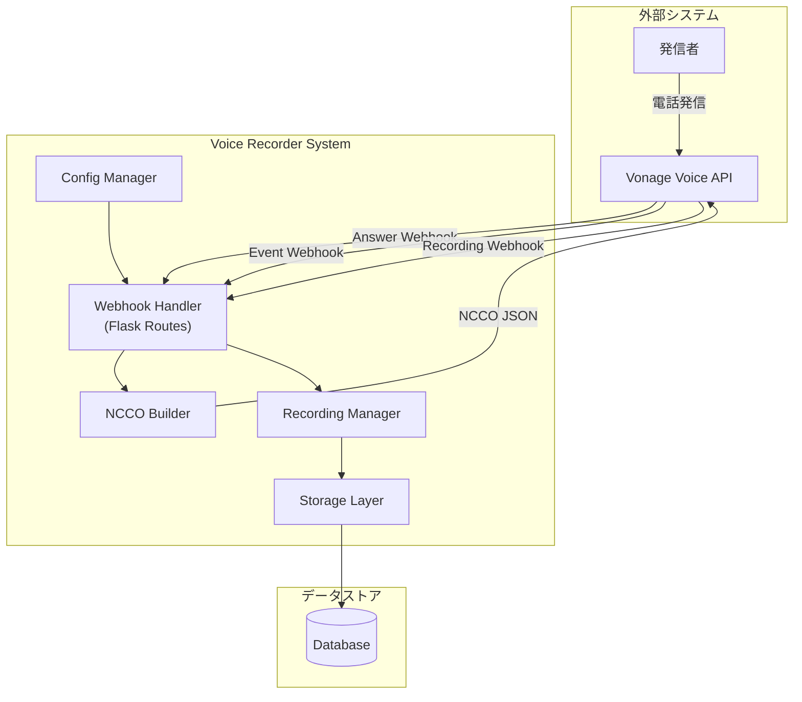
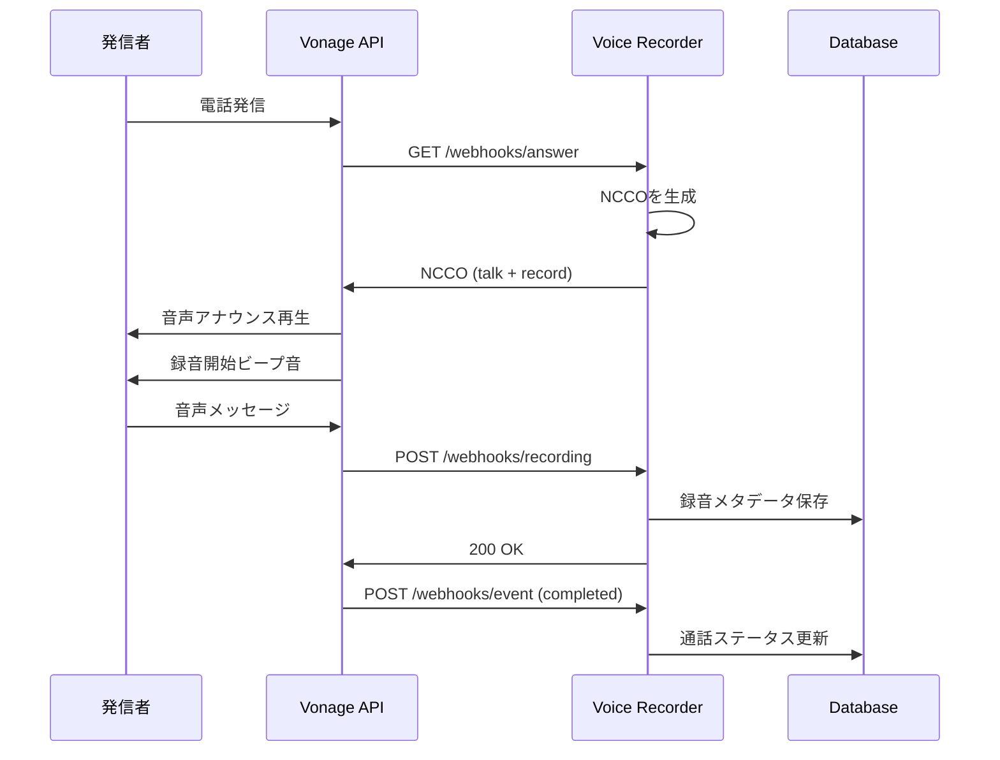

# 設計書

## 概要

本設計書は、Vonage Voice APIを使用した音声録音システムの技術設計を定義します。このシステムはPython Flaskアプリケーションとして実装され、Webhookエンドポイントを通じてVonageからの着信電話を処理し、NCCO (Nexmo Call Control Object) を使用して通話フローを制御します。

### 主要な技術スタック

- **言語**: Python 3.9+
- **Webフレームワーク**: Flask
- **Vonage SDK**: vonage-python-sdk
- **データストレージ**: SQLite (開発) / PostgreSQL (本番)
- **ロギング**: Python標準logging + structlog

## アーキテクチャ



### 通話フロー



## コンポーネントとインターフェース

### 1. Webhook Handler (webhook_handler.py)

着信電話とイベントを処理するFlaskルートを提供します。

```python
from flask import Flask, request, jsonify
from typing import Dict, Any

class WebhookHandler:
    """Vonage Webhookを処理するハンドラー"""
    
    def handle_answer(self, params: Dict[str, Any]) -> list:
        """
        着信電話のAnswer Webhookを処理
        
        Args:
            params: Vonageから送信されるパラメータ
                - uuid: 通話UUID
                - from: 発信者番号
                - to: 着信番号
                - conversation_uuid: 会話UUID
        
        Returns:
            NCCO アクションのリスト
        """
        pass
    
    def handle_recording(self, data: Dict[str, Any]) -> None:
        """
        録音完了Webhookを処理
        
        Args:
            data: 録音データ
                - recording_url: 録音ファイルURL
                - recording_uuid: 録音UUID
                - conversation_uuid: 会話UUID
                - start_time: 録音開始時刻
                - end_time: 録音終了時刻
                - size: ファイルサイズ
                - duration: 録音時間（秒）
        """
        pass
    
    def handle_event(self, data: Dict[str, Any]) -> None:
        """
        通話イベントWebhookを処理
        
        Args:
            data: イベントデータ
                - uuid: 通話UUID
                - status: 通話ステータス
                - timestamp: イベント発生時刻
        """
        pass
```

### 2. NCCO Builder (ncco_builder.py)

通話フローを制御するNCCOを構築します。

```python
from dataclasses import dataclass
from typing import List, Dict, Any, Optional

@dataclass
class TalkAction:
    """Talk NCCOアクション"""
    text: str
    language: str = "ja-JP"
    style: int = 0
    bargeIn: bool = False

@dataclass
class RecordAction:
    """Record NCCOアクション"""
    eventUrl: List[str]
    endOnSilence: int = 3
    endOnKey: str = "#"
    beepStart: bool = True
    timeOut: int = 60
    format: str = "mp3"

class NCCOBuilder:
    """NCCOを構築するビルダークラス"""
    
    def __init__(self, config: 'Config'):
        self.config = config
    
    def build_voicemail_ncco(self, call_uuid: str) -> List[Dict[str, Any]]:
        """
        ボイスメール用NCCOを構築
        
        Args:
            call_uuid: 通話UUID
        
        Returns:
            NCCOアクションのリスト
        """
        pass
    
    def _build_talk_action(self) -> Dict[str, Any]:
        """Talk アクションを構築"""
        pass
    
    def _build_record_action(self) -> Dict[str, Any]:
        """Record アクションを構築"""
        pass
```

### 3. Recording Manager (recording_manager.py)

録音データの管理を担当します。

```python
from dataclasses import dataclass
from datetime import datetime
from typing import Optional, List

@dataclass
class RecordingMetadata:
    """録音メタデータ"""
    id: str
    call_uuid: str
    caller_number: str
    recording_url: str
    duration: int
    timestamp: datetime
    status: str

class RecordingManager:
    """録音データを管理するクラス"""
    
    def __init__(self, storage: 'Storage'):
        self.storage = storage
    
    def save_recording(self, metadata: RecordingMetadata) -> None:
        """録音メタデータを保存"""
        pass
    
    def get_recording(self, call_uuid: str) -> Optional[RecordingMetadata]:
        """通話UUIDで録音を取得"""
        pass
    
    def list_recordings(
        self, 
        start_date: Optional[datetime] = None,
        end_date: Optional[datetime] = None
    ) -> List[RecordingMetadata]:
        """録音一覧を取得"""
        pass
```

### 4. Config Manager (config.py)

環境変数から設定を読み込みます。

```python
from dataclasses import dataclass
from typing import Optional
import os

@dataclass
class Config:
    """アプリケーション設定"""
    vonage_api_key: str
    vonage_api_secret: str
    vonage_application_id: str
    vonage_private_key_path: str
    
    greeting_message: str
    greeting_language: str
    greeting_style: int
    
    max_recording_duration: int
    recording_format: str
    end_on_silence: int
    
    webhook_base_url: str
    answer_url: str
    event_url: str
    recording_url: str
    
    log_level: str
    
    @classmethod
    def from_env(cls) -> 'Config':
        """環境変数から設定を読み込む"""
        pass
    
    def validate(self) -> None:
        """設定の妥当性を検証"""
        pass
```

### 5. Storage Layer (storage.py)

データベース操作を抽象化します。

```python
from abc import ABC, abstractmethod
from typing import Optional, List
from datetime import datetime

class Storage(ABC):
    """ストレージの抽象基底クラス"""
    
    @abstractmethod
    def save_recording(self, metadata: 'RecordingMetadata') -> None:
        """録音メタデータを保存"""
        pass
    
    @abstractmethod
    def get_recording(self, call_uuid: str) -> Optional['RecordingMetadata']:
        """通話UUIDで録音を取得"""
        pass
    
    @abstractmethod
    def list_recordings(
        self,
        start_date: Optional[datetime] = None,
        end_date: Optional[datetime] = None
    ) -> List['RecordingMetadata']:
        """録音一覧を取得"""
        pass
    
    @abstractmethod
    def save_call_log(self, call_log: 'CallLog') -> None:
        """通話ログを保存"""
        pass

class SQLiteStorage(Storage):
    """SQLite実装"""
    pass
```

## データモデル

### Recording テーブル

| カラム名 | 型 | 説明 |
|---------|-----|------|
| id | VARCHAR(36) | 主キー (UUID) |
| call_uuid | VARCHAR(36) | Vonage通話UUID |
| conversation_uuid | VARCHAR(36) | Vonage会話UUID |
| caller_number | VARCHAR(20) | 発信者電話番号 |
| called_number | VARCHAR(20) | 着信電話番号 |
| recording_url | TEXT | 録音ファイルURL |
| recording_uuid | VARCHAR(36) | Vonage録音UUID |
| duration | INTEGER | 録音時間（秒） |
| file_size | INTEGER | ファイルサイズ（バイト） |
| format | VARCHAR(10) | 録音フォーマット |
| status | VARCHAR(20) | ステータス |
| created_at | TIMESTAMP | 作成日時 |
| updated_at | TIMESTAMP | 更新日時 |

### CallLog テーブル

| カラム名 | 型 | 説明 |
|---------|-----|------|
| id | VARCHAR(36) | 主キー (UUID) |
| call_uuid | VARCHAR(36) | Vonage通話UUID |
| caller_number | VARCHAR(20) | 発信者電話番号 |
| called_number | VARCHAR(20) | 着信電話番号 |
| status | VARCHAR(20) | 通話ステータス |
| direction | VARCHAR(10) | 通話方向 (inbound) |
| started_at | TIMESTAMP | 通話開始日時 |
| ended_at | TIMESTAMP | 通話終了日時 |
| created_at | TIMESTAMP | 作成日時 |

```python
from dataclasses import dataclass
from datetime import datetime
from typing import Optional

@dataclass
class Recording:
    """録音データモデル"""
    id: str
    call_uuid: str
    conversation_uuid: str
    caller_number: str
    called_number: str
    recording_url: str
    recording_uuid: str
    duration: int
    file_size: int
    format: str
    status: str
    created_at: datetime
    updated_at: datetime

@dataclass
class CallLog:
    """通話ログデータモデル"""
    id: str
    call_uuid: str
    caller_number: str
    called_number: str
    status: str
    direction: str
    started_at: datetime
    ended_at: Optional[datetime]
    created_at: datetime
```

## 正確性プロパティ

*プロパティとは、システムのすべての有効な実行において真であるべき特性や動作のことです。プロパティは、人間が読める仕様と機械で検証可能な正確性保証の橋渡しをします。*

### プロパティ 1: NCCO構造の妥当性

*任意の*有効なパラメータ（通話UUID、発信者番号、着信番号）を持つ着信電話に対して、生成されるNCCOは、順序通りに正確に2つのアクションを含む有効なJSON配列でなければならない：「talk」アクションの後に「record」アクションが続き、talkアクションは空でないtextフィールドを含み、recordアクションは有効なeventUrlを含むこと。

**検証対象: 要件 1.1, 2.1, 2.2, 3.1, 3.2**

### プロパティ 2: 設定の適用

*任意の*環境変数で設定された設定値に対して、生成されるNCCOはそれらの値を反映すること：talkアクションのtextは設定されたグリーティングメッセージと一致し、talkアクションのlanguageは設定された言語と一致し、recordアクションのtimeOutは設定された最大録音時間と一致すること。

**検証対象: 要件 2.3, 2.4, 3.5, 5.1, 5.3, 5.4, 5.5**

### プロパティ 3: Webhookデータの抽出

*任意の*通話データを含む有効なVonage Webhookペイロードに対して、システムは発信者の電話番号（fromフィールド）と通話UUID（uuidフィールド）をデータの損失や破損なく正しく抽出して返すこと。

**検証対象: 要件 1.2**

### プロパティ 4: エラーレスポンスの処理

*任意の*不正なWebhookリクエスト（必須フィールドの欠落、無効なJSON、誤ったコンテンツタイプ）に対して、システムはHTTP 4xxステータスコードを返し、リクエストを有効として処理しないこと。

**検証対象: 要件 1.4**

### プロパティ 5: 録音メタデータの永続化ラウンドトリップ

*任意の*有効な録音Webhookペイロードに対して、録音メタデータをストレージに保存し、その後通話UUIDで取得した場合、取得されたメタデータは以下の値が同一であること：call_uuid、caller_number、recording_url、duration、timestamp。

**検証対象: 要件 3.3, 3.4, 4.1, 4.2, 4.4**

### プロパティ 6: 録音リストのフィルタリング

*任意の*保存された録音のセットと任意の日付範囲フィルタに対して、list_recordings関数は指定された範囲内にタイムスタンプが含まれる録音のみを正確に返し、フィルタが指定されていない場合はすべての録音を返すこと。

**検証対象: 要件 4.5**

### プロパティ 7: 構造化ログ形式

*任意の*システムによって生成されるログメッセージに対して、ログ出力は最低限timestamp、level、messageフィールドを含む有効なJSONであること。

**検証対象: 要件 1.5, 6.1, 6.2, 6.3, 6.5**

## エラーハンドリング

### Webhook エラー

| エラー種別 | HTTPステータス | 対応 |
|-----------|---------------|------|
| 不正なJSON | 400 Bad Request | エラーログ出力、リクエスト拒否 |
| 必須フィールド欠落 | 400 Bad Request | エラーログ出力、リクエスト拒否 |
| 署名検証失敗 | 401 Unauthorized | セキュリティログ出力、リクエスト拒否 |
| 内部エラー | 500 Internal Server Error | エラーログ出力、スタックトレース記録 |

### 設定エラー

| エラー種別 | 対応 |
|-----------|------|
| 必須環境変数欠落 | 起動時に明確なエラーメッセージで終了 |
| 無効な値 | 起動時にバリデーションエラーで終了 |
| Vonage認証失敗 | エラーログ出力、再試行なし |

### データベースエラー

| エラー種別 | 対応 |
|-----------|------|
| 接続失敗 | リトライ（最大3回）、失敗時はエラーログ |
| 書き込み失敗 | トランザクションロールバック、エラーログ |
| 読み取り失敗 | エラーログ、空結果を返す |

```python
class VoiceRecorderError(Exception):
    """基底例外クラス"""
    pass

class ConfigurationError(VoiceRecorderError):
    """設定エラー"""
    pass

class WebhookValidationError(VoiceRecorderError):
    """Webhook検証エラー"""
    pass

class StorageError(VoiceRecorderError):
    """ストレージエラー"""
    pass
```

## テスト戦略

### テストアプローチ

本システムでは、ユニットテストとプロパティベーステストの両方を使用して包括的なテストカバレッジを実現します。

- **ユニットテスト**: 特定の例、エッジケース、エラー条件の検証
- **プロパティベーステスト**: すべての入力に対して成り立つべき普遍的なプロパティの検証

### プロパティベーステスト設定

- **ライブラリ**: Hypothesis (Python)
- **最小イテレーション数**: 100回/プロパティ
- **タグ形式**: `Feature: vonage-voice-recorder, Property {number}: {property_text}`

### テスト対象

#### ユニットテスト

1. **NCCO Builder**
   - 正常系: 有効なパラメータでNCCO生成
   - エッジケース: デフォルト設定でのNCCO生成
   - エラー系: 無効な設定での動作

2. **Webhook Handler**
   - 正常系: 有効なWebhookペイロード処理
   - エッジケース: 空のペイロード、部分的なデータ
   - エラー系: 不正なJSON、欠落フィールド

3. **Recording Manager**
   - 正常系: 録音メタデータの保存と取得
   - エッジケース: 存在しないUUIDでの検索
   - エラー系: データベース接続失敗

4. **Config Manager**
   - 正常系: 環境変数からの設定読み込み
   - エッジケース: オプション設定の欠落
   - エラー系: 必須設定の欠落

#### プロパティベーステスト

各プロパティテストは設計書の正確性プロパティに対応します：

```python
# Feature: vonage-voice-recorder, Property 1: NCCO構造の妥当性
@given(call_params=valid_call_params())
def test_ncco_structure_validity(call_params):
    """NCCOが有効な構造を持つことを検証"""
    pass

# Feature: vonage-voice-recorder, Property 2: 設定の適用
@given(config=valid_config())
def test_configuration_application(config):
    """設定がNCCOに正しく反映されることを検証"""
    pass

# Feature: vonage-voice-recorder, Property 3: Webhookデータの抽出
@given(payload=valid_webhook_payload())
def test_webhook_data_extraction(payload):
    """Webhookデータが正しく抽出されることを検証"""
    pass

# Feature: vonage-voice-recorder, Property 4: エラーレスポンスの処理
@given(payload=malformed_webhook_payload())
def test_error_response_handling(payload):
    """不正なリクエストが適切に拒否されることを検証"""
    pass

# Feature: vonage-voice-recorder, Property 5: 録音メタデータの永続化ラウンドトリップ
@given(recording=valid_recording_metadata())
def test_recording_metadata_round_trip(recording):
    """録音メタデータの保存と取得が一致することを検証"""
    pass

# Feature: vonage-voice-recorder, Property 6: 録音リストのフィルタリング
@given(recordings=list_of_recordings(), date_range=optional_date_range())
def test_recording_list_filtering(recordings, date_range):
    """日付フィルタリングが正しく動作することを検証"""
    pass

# Feature: vonage-voice-recorder, Property 7: 構造化ログ形式
@given(log_event=any_log_event())
def test_structured_logging_format(log_event):
    """ログ出力が構造化JSONであることを検証"""
    pass
```

### テストデータ生成戦略

```python
from hypothesis import strategies as st

def valid_call_params():
    """有効な通話パラメータを生成"""
    return st.fixed_dictionaries({
        'uuid': st.uuids().map(str),
        'from': st.from_regex(r'\+?[0-9]{10,15}'),
        'to': st.from_regex(r'\+?[0-9]{10,15}'),
        'conversation_uuid': st.uuids().map(str)
    })

def valid_webhook_payload():
    """有効なWebhookペイロードを生成"""
    return st.fixed_dictionaries({
        'recording_url': st.from_regex(r'https://api\.nexmo\.com/v1/files/[a-f0-9-]+'),
        'recording_uuid': st.uuids().map(str),
        'conversation_uuid': st.uuids().map(str),
        'duration': st.integers(min_value=1, max_value=3600),
        'size': st.integers(min_value=1000, max_value=100000000)
    })

def malformed_webhook_payload():
    """不正なWebhookペイロードを生成"""
    return st.one_of(
        st.just({}),  # 空のペイロード
        st.just({'invalid': 'data'}),  # 必須フィールド欠落
        st.text().filter(lambda x: not x.startswith('{')),  # 無効なJSON
    )
```
